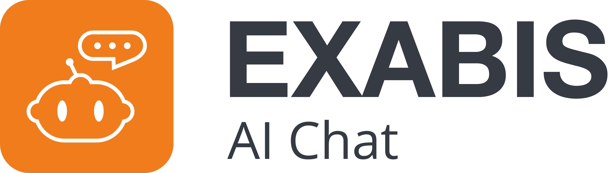

# Exabis AI Chat Block for Moodle



## Main Features

### Source of Truth Configuration

Use contextualized Moodle course data—such as gradebook information, username, and other fields—to enrich AI responses. These can be injected using dynamic placeholders.

### Dynamic Placeholders

**Custom User Messages with dynamic placeholders:**
Each block instance can define an initial message sent to the AI. The message supports user- and course-based placeholders that are automatically replaced before the request is sent.

**Example message template:**

```text
My name is {user.fullname} and my final course grade is {grade:Final Grade}.
```

These placeholders are replaced with actual user and course data before being sent.

As the AI is not aware of the current date/time, you can also add a placeholder for the current date/time, such as `{userdate}`.

### Custom Instructions

Define communication style or behaviour for different target groups within a course.

**Example:** act like a tutor

> “Act as a patient, friendly teacher. Explain each concept as if to a beginner. Use plain words, short sentences, and real-world examples. Where appropriate, give step-by-step instructions and small practice tasks the student can try. Ask one follow-up question to check understanding.”

### Course Configuration

Trainers can use their own API keys on a per-course level—no admin configuration needed.

### Moodle AI Provider Integration

* All configured Moodle AI Providers can be used in the AI Chat Block
* Users are able to switch between different AI Providers

### Supported AI Providers

Currently supported and tested AI Providers:

* OpenAI
* Ollama
* Google Gemini

All other OpenAI-compatible providers can also be used.

### Prompt Logging

All API requests can be logged and later reviewed by course trainers.

**Access path:**

> Course → More → Reports → Exabis AI Chat Logs

## Free AI Models and API Keys

The AI Chat Block can be used without paid licenses by leveraging free or self-hosted AI providers. These options are ideal for testing, experimentation, or cost-sensitive environments.
 
* **Google AI Studio:** [https://aistudio.gogle.com/](https://aistudio.gogle.com/)

  Offers Google Gemini AI

* **Ollama:** [https://ollama.com/](https://ollama.com/)

  Can be self-hosted on local servers or as a cloud service

  Offers Ollama, DeepSeek and other AIs
  
  List of AI models: [https://ollama.com/search?c=cloud&o=newest](https://ollama.com/search?c=cloud&o=newest)

## Use Cases

* **Provide grading rules:** Trainers define rules in the instruction field for how grading inquiries should be answered.
* **Contextualized student questions:** Students can ask course-specific questions using gradebook data (e.g. *“What do I need to do to pass this course?”*).
* **Target-group–specific communication styles:** For example, *“Act as a Tutor”*, *“Talk like a pirate”*, etc.
* **Prompt reflection:** Trainers can review prompt logs in course reports.
* **Experiment with AI models:** Trainers can use their own API keys to test different AIs.

## Advanced Features

### Simple RAG Integration

Files uploaded to the OpenAI Platform can be queried by the AI agent.

**Instructions:**

1. Create a new vector store on the OpenAI Platform:
   [https://platform.openai.com/storage/vector_stores/](https://platform.openai.com/storage/vector_stores/)
2. Add files to the newly created vector store (processing may take a couple of minutes).
3. Configure the vector store ID (e.g. `vs_1234abc`) in the block settings.

### API Support

* **Responses API Support** (new API from OpenAI)
* **Assistant API Support** (deprecated API from OpenAI)

### Azure OpenAI Support

* Azure (self-hosted OpenAI)
* Supports Azure-hosted OpenAI instances

## Planned Features

* Allow trainers to pre-select available AI models for students

### User-Based Vector Storage (RAG)

This feature allows students to ask the AI questions about any course materials, such as PDFs, Word files, presentations, or text documents.

All these files are automatically analysed and stored in a student-specific **knowledge base** (a vector store) on the AI Provider servers.

* Extended placeholder support

## Further Documentation

For more documentation, visit:
[https://www.exabis.at/en/moodle-modules/ki-chat/funktionen](https://www.exabis.at/en/moodle-modules/ki-chat/funktionen)

## Acknowledgements

The original development of the block was carried out by **GTN** in collaboration with the **Laboratory for Advanced Technology in Education** at the **University of Zagreb – Faculty of Organization and Informatics**.

The Laboratory contributed to the plugin’s conceptual design, pedagogical framework, and evaluation process, bringing extensive expertise in educational technology and its application within higher education contexts.

For more information, visit:
[https://www.foi.unizg.hr/en/about-us/departments/late](https://www.foi.unizg.hr/en/about-us/departments/late)
